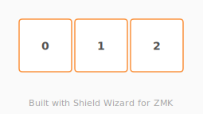

# ZMK Configuration for mini-3-chocv2

*Generated by Shield Wizard for ZMK*



Download compiled firmware from the Actions tab. <https://zmk.dev/docs/user-setup#installing-the-firmware>

Edit your keymap <https://zmk.dev/docs/keymaps>.
User keymap is located at [`config/mini_3_chocv2.keymap`](config/mini_3_chocv2.keymap).

-----

<details>
<summary>
Shield Wizard Debug Information
</summary>

In case of broken configuration, here is the Shield Wizard internal data used to generate this configuration:

Commit: 6771417768468d480226b5f17922324c10eb423e

```json
{"name":"mini-3-chocv2","shield":"mini_3_chocv2","dongle":false,"modules":[],"layout":[{"id":"01KX6FYJ9ZEYDCHKGZ2VTG50GP","part":0,"row":0,"col":0,"w":1,"h":1,"x":0,"y":0,"r":0,"rx":0,"ry":0},{"id":"01KX6FYK8KZSG59XFFHFT70SCP","part":0,"row":0,"col":1,"w":1,"h":1,"x":1,"y":0,"r":0,"rx":0,"ry":0},{"id":"01KX6FYKSV76CPK8RY608A3SPV","part":0,"row":0,"col":2,"w":1,"h":1,"x":2,"y":0,"r":0,"rx":0,"ry":0}],"parts":[{"name":"unibody","controller":"nice_nano_v2","pins":{"d20":{"usage":"kscan","kscan":"01KX6G34DYRTYS70P03W603MB3","role":"input"},"d19":{"usage":"kscan","kscan":"01KX6G34DYRTYS70P03W603MB3","role":"input"},"d18":{"usage":"kscan","kscan":"01KX6G34DYRTYS70P03W603MB3","role":"input"}},"kscans":[{"kind":"direct","id":"01KX6G34DYRTYS70P03W603MB3","mode":"gnd"}],"keys":{"01KX6FYJ9ZEYDCHKGZ2VTG50GP":{"input":"d20"},"01KX6FYK8KZSG59XFFHFT70SCP":{"input":"d19"},"01KX6FYKSV76CPK8RY608A3SPV":{"input":"d18"}},"encoders":[],"buses":{}}]}
```

</details>
